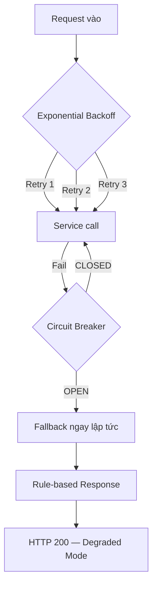

# 🛡️ CẨM NANG CHAOS ENGINEERING — LEVEL 8 (TC71 → TC80)

> **Đối tượng**: Kỹ sư QA/DevOps muốn **phá hệ thống** để chứng minh nó sống sót.
> **Mục tiêu**: Chứng minh hệ thống CAB không crash khi service, database, hoặc message queue bị ngắt.

---

## 📖 NGUYÊN LÝ: TẠI SAO CẦN CHAOS ENGINEERING?

### Bài toán thực tế

Trong hệ thống microservices, các service gọi lẫn nhau. Nếu **một service chết**, domino effect sẽ kéo sập toàn bộ hệ thống:

```
Booking Service → gọi AI Service (chết) → timeout 30s → thread bị block
                → gọi Pricing Service (chết) → timeout 30s → thread bị block
                → 100 user cùng gọi → 100 thread bị block → Booking Service SẬP
```

### Giải pháp: 3 tầng bảo vệ



| Tầng | Pattern | Thư viện | Vai trò |
|------|---------|----------|---------|
| 1 | **Exponential Backoff** | `axios-retry` | Retry 3 lần, delay tăng dần (100ms → 200ms → 400ms) |
| 2 | **Circuit Breaker** | `opossum` | Sau 50% fail → NGẮT MẠCH → trả fallback ngay |
| 3 | **Graceful Degradation** | Custom | Trả giá trị rule-based thay vì crash |

### Circuit Breaker States

```
  ┌──────────┐   50% fail    ┌──────────┐   10s cooldown   ┌───────────┐
  │  CLOSED  │ ────────────→ │   OPEN   │ ───────────────→ │ HALF-OPEN │
  │ (Normal) │               │(Reject)  │                  │  (Test 1) │
  └──────────┘               └──────────┘                  └───────────┘
       ↑                                                         │
       │                          success                        │
       └─────────────────────────────────────────────────────────┘
                                  fail → back to OPEN
```

- **CLOSED**: Bình thường, mọi request đi qua service thật
- **OPEN**: Service chết → TỪ CHỐI gọi, trả fallback NGAY (< 1ms)
- **HALF-OPEN**: Sau 10 giây, thử 1 request. Thành công → CLOSED. Thất bại → OPEN lại.

---

## 🚀 CHUẨN BỊ

```bash
# Terminal 1: Infra
docker-compose up -d

# Terminal 2: Services
npm run start:all

# Verify
curl http://localhost:3000/api/bookings/circuit-breaker/stats
```

---

## 🧪 PHẦN 1: TEST TỰ ĐỘNG

### Chạy test Level 8

```bash
npm run test:level8
```

### Chạy toàn bộ (Level 1-8)

```bash
npm test
```

---

## 🔥 PHẦN 2: CHAOS ENGINEERING THỦ CÔNG

### TC71 + TC75: Tắt Pricing Service → Xem Circuit Breaker hoạt động

**Bước 1: Xem trạng thái ban đầu**
```bash
curl -s http://localhost:3000/api/bookings/circuit-breaker/stats | jq .
```

```json
{
  "breakers": {
    "ai-eta": { "state": "CLOSED", "stats": { "fires": 0, "fallbacks": 0 } },
    "pricing": { "state": "CLOSED", "stats": { "fires": 0, "fallbacks": 0 } }
  }
}
```

**Bước 2: Tắt Pricing Service**
```bash
# Nếu chạy Docker
docker stop cab_pricing

# Nếu chạy local → kill process pricing trên port 4006
# Windows:
taskkill /F /PID $(netstat -ano | findstr :4006 | head -1 | awk '{print $5}')
```

**Bước 3: Bắn 5 request booking liên tục**
```bash
for i in $(seq 1 5); do
  echo "=== Request $i ==="
  time curl -s -X POST http://localhost:3000/api/bookings \
    -H "Content-Type: application/json" \
    -H "Authorization: Bearer YOUR_TOKEN" \
    -d '{"pickup":{"lat":10.76,"lng":106.66},"drop":{"lat":10.77,"lng":106.70},"distance_km":5}'
  echo ""
done
```

**Kết quả mong đợi:**

| Request | Thời gian | Giải thích |
|---------|-----------|------------|
| #1 | ~3s | Timeout chờ Pricing → fail → fallback |
| #2 | ~3s | Retry + timeout (CB chưa mở, chưa đủ volumeThreshold) |
| #3 | ~3s | Retry + fail → CB đang tích lũy lỗi |
| #4 | **< 50ms** ⚡ | **CB OPENED!** → Trả fallback NGAY, không gọi service |
| #5 | **< 50ms** ⚡ | CB vẫn OPEN → Fallback ngay lập tức |

> [!IMPORTANT]
> **MẮT THẤY TAI NGHE**: Request đầu chậm (do timeout), nhưng từ request thứ 4+ thì **siêu nhanh** vì Circuit Breaker đã OPEN → trả giá fallback ngay không cần gọi Pricing.

**Bước 4: Xem stats sau khi break**
```bash
curl -s http://localhost:3000/api/bookings/circuit-breaker/stats | jq .
```

```json
{
  "breakers": {
    "pricing": {
      "state": "OPEN",
      "stats": { "fires": 5, "successes": 0, "failures": 3, "fallbacks": 5, "rejects": 2 }
    }
  }
}
```

**Bước 5: Bật lại Pricing → CB tự phục hồi**
```bash
docker start cab_pricing
# Chờ 10 giây (resetTimeout)
sleep 10

# Gửi request → CB chuyển HALF-OPEN → test 1 request → thành công → CLOSED
curl -s -X POST http://localhost:3000/api/bookings \
  -H "Content-Type: application/json" \
  -H "Authorization: Bearer YOUR_TOKEN" \
  -d '{"pickup":{"lat":10.76,"lng":106.66},"drop":{"lat":10.77,"lng":106.70},"distance_km":5}'

# Kiểm tra lại → CLOSED
curl -s http://localhost:3000/api/bookings/circuit-breaker/stats | jq .breakers.pricing.state
# → "CLOSED"
```

---

### TC73: Tắt Kafka → Event bị buffer → Bật lại → Event tự chảy

**Bước 1: Tắt Kafka**
```bash
docker stop cab_kafka
```

**Bước 2: Tạo booking**
```bash
curl -s -X POST http://localhost:3000/api/bookings \
  -H "Content-Type: application/json" \
  -H "Authorization: Bearer YOUR_TOKEN" \
  -d '{"pickup":{"lat":10.76,"lng":106.66},"drop":{"lat":10.77,"lng":106.70},"distance_km":5}'
```

> [!TIP]
> Booking được tạo thành công (HTTP 201) vì event được lưu vào bảng `outbox_events` (DB) thay vì gửi trực tiếp qua Kafka.

**Bước 3: Kiểm tra events bị kẹt trong DB**
```bash
docker exec -it cab_postgres psql -U cab_user -d cab_booking_db -c \
  "SELECT id, topic, processed, created_at FROM outbox_events WHERE processed = false ORDER BY id DESC LIMIT 5;"
```

```
 id |    topic     | processed |         created_at
----+--------------+-----------+----------------------------
 42 | ride_events  | false     | 2026-04-14 15:30:00+07
 41 | ride_events  | false     | 2026-04-14 15:29:55+07
```

> [!CAUTION]
> Thấy `processed = false` → nghĩa là event BỊ KẸT trong DB. Kafka đang down nên outboxPublisher không thể gửi đi. Nhưng **HỆ THỐNG KHÔNG CRASH** — booking vẫn hoạt động bình thường.

**Bước 4: Mở Terminal chạy services → Xem log outbox**
```
[Outbox] ⚠️ Kafka publish failed for event #42 (attempt 1): ...
[Outbox] ⚠️ Kafka publish failed for event #42 (attempt 2): ...
[Outbox] ⚠️ Kafka still down — suppressing further logs. 2 events buffered in DB, will auto-retry.
```

**Bước 5: Bật lại Kafka**
```bash
docker start cab_kafka
# Chờ 10-15 giây cho Kafka khởi động
sleep 15
```

**Bước 6: Kiểm tra events đã được gửi bù**
```bash
docker exec -it cab_postgres psql -U cab_user -d cab_booking_db -c \
  "SELECT id, topic, processed FROM outbox_events ORDER BY id DESC LIMIT 5;"
```

```
 id |    topic     | processed
----+--------------+-----------
 42 | ride_events  | true      ← ĐÃ GỬI!
 41 | ride_events  | true      ← ĐÃ GỬI!
```

> Xem log terminal:
> ```
> [Outbox] ✅ Kafka recovered after 5 failed attempts
> [Outbox] Published event #41 to topic "ride_events"
> [Outbox] Published event #42 to topic "ride_events"
> ```

---

### TC80: AI Agent sập → Hệ thống rơi về Rule-based

**Dùng Postman hoặc curl:**
```bash
curl -s -X POST http://localhost:3000/api/ai/orchestrate \
  -H "Content-Type: application/json" \
  -d '{
    "drivers": [
      {"driver_id":"D1","distance_km":1,"rating":4.5,"status":"ONLINE","price":30000},
      {"driver_id":"D2","distance_km":3,"rating":4.8,"status":"ONLINE","price":50000},
      {"driver_id":"D3","distance_km":0.5,"rating":5.0,"status":"OFFLINE","price":20000}
    ],
    "distance_km": 5,
    "traffic_level": 0.3,
    "simulate_agent_fail": true
  }' | jq .
```

```json ky vong
{
  "data": {
    "selected_driver": { "driver_id": "D1" },
    "is_fallback": true,
    "decision_log": "[AGENT DECISION] FALLBACK — Selected first ONLINE driver D1 (rule-based, agent failed)."
  }
}
```

> [!NOTE]
> Agent thử 3 lần (retry) → tất cả fail → chuyển sang **Rule-based**: chọn driver ONLINE đầu tiên (D1). D3 bị loại vì OFFLINE. Hệ thống **KHÔNG CRASH** — vẫn HTTP 200.

---

## 📊 PHẦN 3: BẢNG TÓM TẮT TC71 → TC80

| TC | Tên | Cách test | Expect |
|----|------|-----------|--------|
| 71 | Service Down | `simulate_network_fail: true` | 201 + `fallback_triggered: true` |
| 72 | CB Stats | `GET /circuit-breaker/stats` | Trạng thái CLOSED/OPEN |
| 73 | Kafka Buffer | `docker stop kafka` → booking | Event buffered, hệ thống không crash |
| 74 | DB Pool | 5 concurrent bookings | Tất cả 201 OK |
| 75 | CB Opens | 5× network fail → stats | `fallbacks > 0` |
| 76 | Price Fallback | Network fail, dist=8 | price = 120000 (15000×8) |
| 77 | Exp. Backoff | Network fail → timing | Resolve < 15s, fallback=true |
| 78 | Normal Path | Booking bình thường | `fallback_triggered: false`, CB=CLOSED |
| 79 | CB Reset | POST reset → stats | All breakers CLOSED |
| 80 | AI Fallback | `simulate_agent_fail: true` | `is_fallback: true`, ONLINE driver selected |

---

## 🎓 PHẦN 4: GIẢI THÍCH CHO HỘI ĐỒNG

### Câu hỏi: "Nếu Pricing Service chết, hệ thống sẽ thế nào?"

**Trả lời:**

1. **3 request đầu**: Booking Service gọi Pricing, bị timeout 3s. `axios-retry` retry 3 lần với **exponential backoff** (100ms → 200ms → 400ms). Tổng ~4s/request. Cuối cùng trả giá fallback `15000 × distance`.

2. **Từ request 4+**: Circuit Breaker **chuyển sang OPEN**. Booking Service **KHÔNG gọi Pricing nữa**, trả fallback **ngay lập tức** (< 1ms). User vẫn đặt xe được, chỉ giá không chính xác tuyệt đối.

3. **Khi Pricing phục hồi**: Sau 10s, CB chuyển **HALF-OPEN**, thử 1 request. Thành công → **CLOSED**, quay lại bình thường.

### Câu hỏi: "Nếu Kafka chết?"

**Trả lời:**

Events được lưu vào bảng `outbox_events` trong cùng transaction với booking (Outbox Pattern — TC38). Khi Kafka down, background worker (`outboxPublisher.js`) sẽ:

1. **KHÔNG xóa** event khỏi outbox (giữ `processed = false`)
2. **KHÔNG crash** vòng lặp — continue sang event tiếp theo
3. **Tự động retry** mỗi 2 giây
4. Khi Kafka up lại → gửi bù tất cả events bị kẹt

### Câu hỏi: "Code pattern nào đảm bảo thread safety?"

**Trả lời:**

- `opossum` sử dụng **rolling window** (10 buckets × 1s) để đếm failures, không dùng global counter
- Mỗi request có scope riêng — không chia sẻ state giữa các request
- DB Pool `max: 20` + `connectionTimeout: 2000ms` → fail fast thay vì block thread

---

## ✅ KẾT LUẬN

Nếu tất cả test pass:

```
Test Suites: 8 passed, 8 total
Tests:       80 passed, 80 total
```

→ Hệ thống CAB đã hoàn thành **Failure & Resilience** với:
- 🔌 **Circuit Breaker** — Ngắt mạch khi service chết, tự phục hồi
- ⏱️ **Exponential Backoff** — Retry thông minh, không gây DDoS nội bộ
- 🛡️ **Graceful Degradation** — Luôn trả response, không bao giờ crash
- 📦 **Kafka Buffering** — Events không mất, tự gửi bù khi hồi phục
